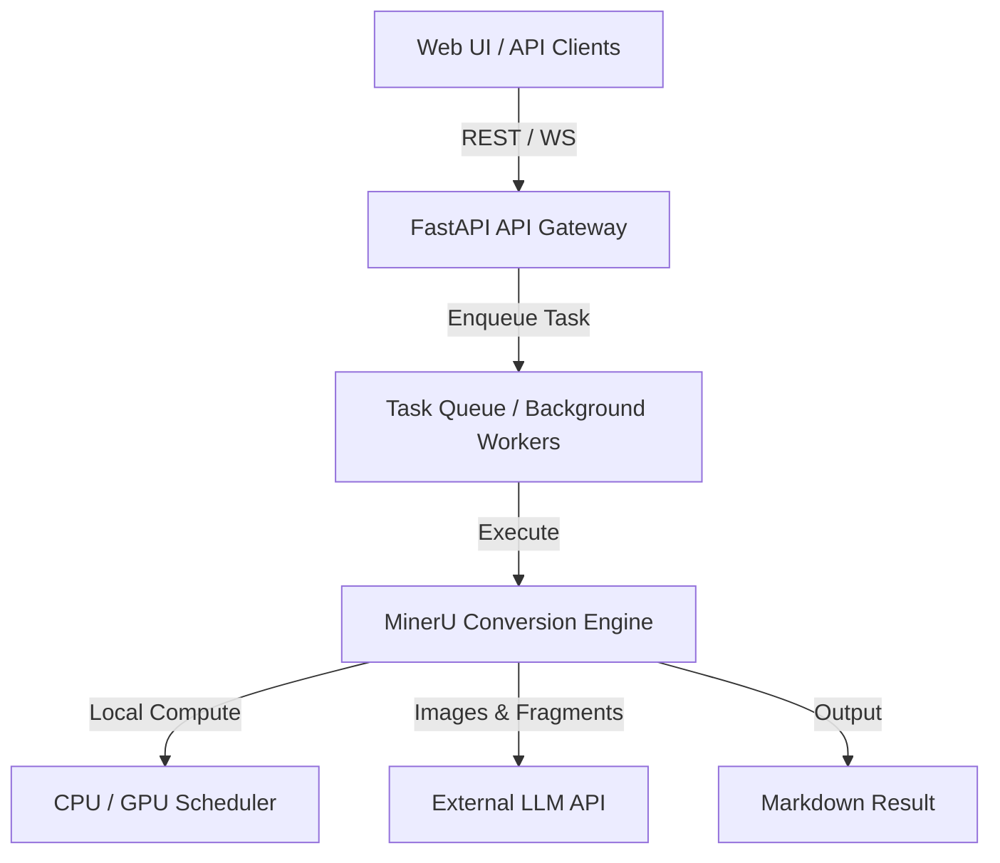

# Architecture Overview

| Version | Date | Description | Author |
| :--- | :--- | :--- | :--- |
| v1.0.0 | 2026-06-12 | Initial blueprint for Doc2MD system architecture | Gemini CLI |
| v1.1.0 | 2026-06-13 | Switch core parsing engine from Docling to MinerU (MagicDocs) | Gemini CLI |

---

## 1. System Components

## 2. Component Specifications

- **Frontend**: Single-page application providing user controls for CPU/GPU configuration and model selection.
- **Backend API**: Exposes asynchronous conversion tasks, status polling, and configuration adjustment.
- **Engine Layer**: Interfaces directly with MinerU (PDF-Extract-Kit), supporting high-precision document layout analysis, table recognition, and mathematical formula parsing. GPU acceleration strongly recommended.

---

## Related
- [Design Index](index.md)
- [Requirements Index](../requirements/index.md)
