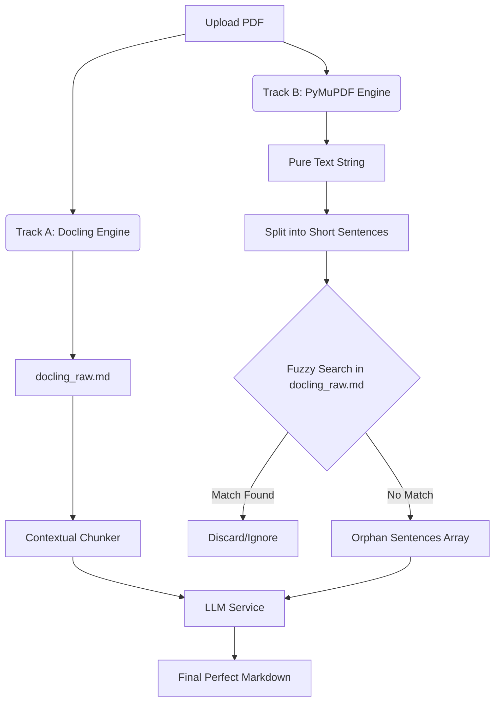

# 双轨兜底与孤儿句子回收设计 (Dual-Track Fallback Design)

| Version | Date       | Description                                  | Author     |
| :------ | :--------- | :------------------------------------------- | :--------- |
| v1.0.0  | 2026-06-13 | 初始设计文档，针对 Docling 版面丢字痛点提供解决方案 | Gemini CLI |

## 1. 背景与痛点 (Background)

在 PDF 转 Markdown 的处理管线中，核心解析引擎 Docling 依赖 LayoutLM 版面大模型。虽然它能完美重构复杂表格和页面排版，但在特定场景下（如不规则留白、悬挂缩进的列表编号等），LayoutLM 会产生置信度过低的情况，导致包含关键信息的文本块被模型视为“排版噪音（Unassociated Content）”而直接丢弃。

这导致生成的 `raw.md` 中发生物理级的“不可逆漏字”。由于这类医疗或法律指南对内容的完整性要求极高，系统必须引入一套绝对不漏字的兜底机制。

## 2. 方案难点：阅读顺序错乱 (The Reading Order Dilemma)

如果仅为了“不漏字”，我们可以直接使用 `PyMuPDF` (底层基于物理坐标流提取)。但复杂 PDF 往往存在多栏、侧边栏、浮动文本框。传统引擎按代码流提取时，其生成的纯文本阅读顺序通常是严重混乱的（例如跨栏交错拼接）。

如果直接用这段乱序文本做比对或喂给大模型，会导致逻辑严重错位。因此，不能依赖“顺序对比”，必须引入**无序集合比对**机制。

## 3. 系统架构与处理流 (Architecture & Pipeline)

本机制被称为**“孤儿句子回收+大模型语义拼图”**，处理流分为四个核心步骤：

### 3.1 步骤一：双轨并行提取 (Dual-Track Extraction)
当收到处理任务时，后端在 `tasks.py` 中分两条线路同时解析同一个 PDF 文件：
- **主轨道 (Track A)**：Docling 引擎，输出排版精美的 `docling_raw.md`，但可能潜藏漏字。
- **兜底轨道 (Track B)**：`pypdfium2` 引擎，物理提取得到绝对不漏字（但可能乱序）的原生字符串集 `pure_text`。

### 3.2 步骤二：纯文本打碎 (Tokenization & Segmentation)
利用正则表达式和标点符号规则，将 `pure_text` 切碎为独立的短句集合（List of Sentences）。
- 过滤掉超短的干扰符（如单独的换行、特殊标点）。
- 设置一个特征长度阈值（例如：长度 > 10 个字符）作为有效语义单位。

### 3.3 步骤三：乱序求差集 (Orphan Identification)
遍历打碎后的“原生短句集合”，在精美的 `docling_raw.md` 全文中执行高容错度的包含度匹配（Fuzzy String Matching / N-gram 比较）。
- 如果原生短句在 MD 中无法找到匹配的对应文段，则判定该句被 Docling 遗弃。
- 将这些被遗漏的句子收集到一个数组中，称为 **孤儿句子集合 (Orphan Sentences)**。

### 3.4 步骤四：大模型语义归位 (LLM Contextual Puzzle)
将现有的 `llm_service.py` 中的提示词架构进行升级。
在对 `docling_raw.md` 分块发给大模型进行清洗和格式统一时，将整理好的 `Orphan Sentences` 作为额外附录一并注入 Prompt：

```markdown
请清洗以下排版文本：
[Docling_MD_Chunk]

【紧急插播】我们在前置校验中发现解析引擎可能漏掉了以下几句话：
1. 适应从家庭向学校的转变...
2. ...
如果这些句子逻辑上属于当前文本块，请不要生硬追加，而是分析上下文语义，将它们无缝地缝合/插回最合适的段落内部。
```

## 4. 数据流图 (Data Flow)



## 5. 预期收益 (Expected Benefits)
1. **0 漏字率兜底**：利用物理引擎绝对保障关键业务文本不丢失。
2. **免受乱序干扰**：不依赖提取文本的上下文顺序，利用大模型的强大逻辑推理能力来做位置找回。
3. **零排版破坏**：主干结构依然享受 Docling 对表格和复杂排版的完美重建红利。

## Related
- [ARCH_OVERVIEW.md](ARCH_OVERVIEW.md)
