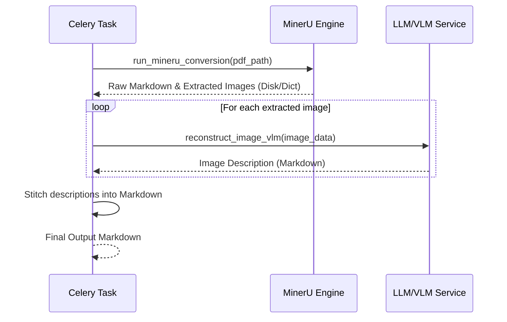

# MinerU Migration Strategy

| Version | Date | Description | Author |
| :--- | :--- | :--- | :--- |
| v1.0.0 | 2026-06-13 | Define migration strategy from Docling to MinerU | Gemini CLI |

---

## 1. Background

Doc2MD initially utilized **Docling** (powered by LayoutLM) for PDF parsing. While Docling is fast and provides reasonable Markdown extraction, it exhibits a fatal flaw in complex Chinese layouts (e.g., standard clinical practice guidelines): it **silently drops text** it considers extraneous (like headers/footers), but its heuristic often misclassifies core body text as noise, leading to unacceptable data loss.

Efforts to mitigate this with a "Dual-Track Fallback" (extracting raw text via PyPDFium2 and using LLMs to stitch "orphan sentences" back in) failed because LLMs face context conflicts and struggle to reliably inject missing text across large Markdown chunks without violating instructions to not hallucinate.

**Solution**: Completely replace Docling with **MinerU (MagicDocs)**. MinerU provides SOTA accuracy for PDF layout analysis, formula extraction, and table generation, with robust mechanisms to ensure 100% text retention without silent dropping.

---

## 2. Migration Scope

### 2.1 Backend Refactoring
1. **Remove Docling Dependencies**: Uninstall Docling to save space.
2. **Install MinerU (Magic-PDF)**: Install `magic-pdf` and configure it for GPU/CUDA acceleration.
3. **Refactor Pipeline Service (`docling_service.py` -> `mineru_service.py`)**:
   - Create a unified `run_mineru_conversion(pdf_path, options)` function.
   - Output artifacts must map accurately: Raw Markdown text, extracted table structures, and extracted image elements.
4. **LLM VLM Interception**: MinerU naturally extracts images. We will configure MinerU to output images to a temporary directory, convert them to Base64 (or directly pass file paths), and feed them into our existing VLM logic (`llm_service.py`) for semantic descriptions.

### 2.2 System & Environment Changes
- MinerU requires downloading its specific model weights (`pdf-extract-kit` models).
- We must configure the magic-pdf configuration file (`magic-pdf.json`) to point to the correct model directory and use CUDA (`cuda:0`).

---

## 3. Data Flow with MinerU

## 4. Risks & Considerations
- **Environment Overhead**: MinerU's model weights are large. Time must be allocated to download and verify them on the `x-server`.
- **Latency**: MinerU's precise models might be slower than Docling. We need to monitor conversion times.
- **Dependency Conflicts**: Ensure `magic-pdf` doesn't conflict with existing FastAPI/Celery Python dependencies.

---

## Related
- [Architecture Overview](ARCH_OVERVIEW.md)
- [Docling Dropped Text Issue](../../.learnings/experience/docling_layoutlm_dropped_text.md)
