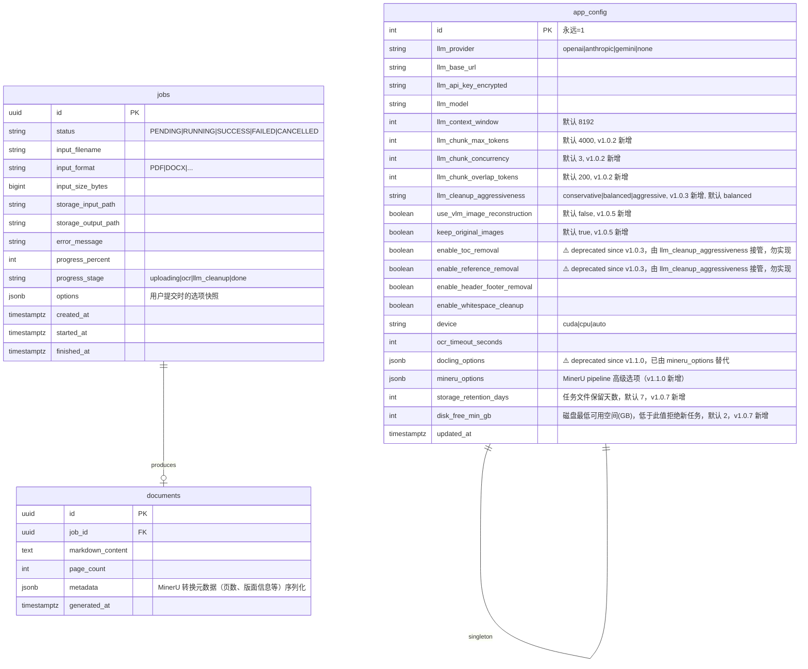
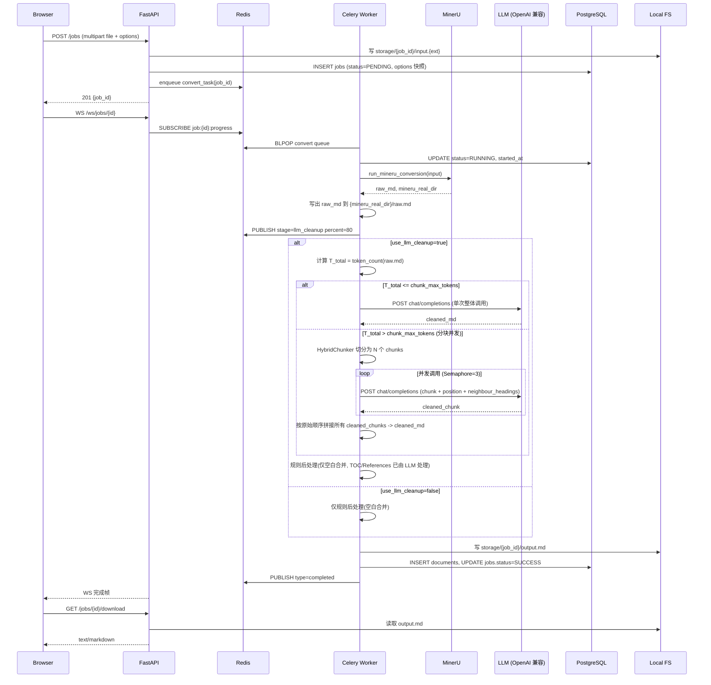

# Doc2MD System Design Document

| Version | Date | Description | Author |
| :--- | :--- | :--- | :--- |
| v1.0.0 | 2026-06-12 | Initial comprehensive system design for Doc2MD | Claude Fable 5 |
| v1.0.1 | 2026-06-12 | Clarification: deployment & testing must run on x-server (VPN-only), all Python deps in shared `/media/data/venv` | Claude Fable 5 |
| v1.0.2 | 2026-06-12 | LLM cleanup pipeline: add HybridChunker-based long-doc strategy with threshold routing, per-chunk degradation, and chunk-level progress | Claude Fable 5 |
| v1.0.3 | 2026-06-12 | TOC/References removal: replace naive regex rules (误杀风险) with LLM-driven detection, gated by chunk-position awareness to avoid boundary blindness | Claude Fable 5 |
| v1.0.4 | 2026-06-12 | WS connection: add DB compensation snapshot & terminal closure on handshake to prevent progress freeze on page reload | Claude Fable 5 |
| v1.0.5 | 2026-06-12 | Picture/Chart pipeline: implement ImageRefMode.EMBEDDED (Base64) with multi-step VLM routing (Classifier -> specialized Mermaid/Markdown/LaTeX workers) | Claude Fable 5 |
| v1.0.6 | 2026-06-12 | Configuration: remove upload file size limit (unlimited) | Claude Fable 5 |
| v1.0.7 | 2026-06-12 | Fix: add generate_picture_images config in §5.1; add disk guard & stream upload & auto-cleanup in §7.2; add estimated_vlm_calls & vlm_image stage in §4; add snapshot frame spec in §4.2.3; deprecate enable_toc/ref_removal fields; update Phase C summary | Claude Fable 5 |
| v1.1.0 | 2026-06-13 | **Engine migration**: replace Docling with MinerU (magic-pdf) as core parsing engine; update §1.1, §2, §3, §5.1, §6.1.3, §7.1, §7.2, §7.3, §8; MinerU uses magic-pdf CLI + rglob output discovery | Gemini CLI |
| v1.2.0 | 2026-06-14 | **批量上传**：前端预览队列 + 顺序上传方案；更新 §6.1.1 首页交互规范；后端 API 无需改动 | Gemini CLI |

---

## 1. Project Vision & Goals

**Doc2MD** 是一个高性能的智能文档转 Markdown 平台，旨在将各种非结构化或半结构化文档（如 PDF、DOCX、PPTX、图片、HTML 等）转换为结构清晰、排版整洁、适合大模型（RAG/LLM）消费或直接阅读的 Markdown 格式。

### 1.1 核心目标
- **高保真转换**：集成 **MinerU (magic-pdf)** 作为核心布局分析与转换引擎（自 v1.1.0 起替换原 Docling 引擎），在 GPU 加速下实现高保真的文档解析，支持 Pascal 架构显卡（GTX 1080, sm_61）。
- **智能后处理**：集成 LLM 清洗管道，智能去除文档转换后产生的页眉、页脚、页码、冗余空白等噪音，并提供目录和参考文献的可选去除功能。
- **生产就绪架构**：基于 FastAPI、Celery、Redis 和 PostgreSQL，采用异步任务队列、单进程 GPU 独占、WebSocket 进度推送等机制，确保系统在高负载下的稳定性和响应性。
- **现代化 Web UI**：提供极简、美观、响应迅速的 React 页面，支持文件拖拽上传、选项配置、实时进度跟踪、双栏 Markdown 预览和一键导出下载。

---

## 2. System Architecture & Process Topology

系统采用三层架构设计：前端 Web UI、API 路由网关、异步任务处理 Worker。

```
┌─────────────────────────────────────────────────────────────────┐
│                         x-server 主机                           │
│                                                                 │
│  ┌──────────┐   HTTPS    ┌──────────────┐                      │
│  │ Browser  │◀──────────▶│   Nginx      │ :80/:443             │
│  └──────────┘            │ (前端静态)   │                      │
│       │  WSS             │ (反代 /api)  │                      │
│       │                  └──────┬───────┘                      │
│       │                         │                              │
│       │                         ▼                              │
│       │              ┌──────────────────────┐                  │
│       │              │   FastAPI (uvicorn)  │ :8000            │
│       │              │  - REST API          │                  │
│       │              │  - WebSocket /ws     │                  │
│       │              │  - 上传 / 配置读写   │                  │
│       │              └────────┬─────────────┘                  │
│       │                       │                                │
│       │            enqueue    │    broker                      │
│       │                       ▼                                │
│       │              ┌──────────────────────┐                  │
│       │   进度推送   │       Redis          │ :6379            │
│       │   (pub/sub)  │  - broker            │                  │
│       │              │  - result backend    │                  │
│       │              │  - pub/sub 频道      │                  │
│       │              └────────┬─────────────┘                  │
│       │                       │                                │
│       │                       ▼                                │
│       │              ┌──────────────────────┐                  │
│       │                       │                                │
│       │                       ▼                                │
│       │              ┌──────────────────────┐                  │
│       │              │  Celery Worker (×1)  │  独占 GPU         │
│       │              │  - MinerU(GPU/CPU)   │                  │
│       │              │  - LLM 清洗 (可选)   │                  │
│       │              └────────┬─────────────┘                  │
│       │                       │                                │
│       │                       ▼                                │
│       │              ┌──────────────────────┐                  │
│       │              │    PostgreSQL        │ :5432            │
│       │              │  - jobs              │                  │
│       │              │  - documents         │                  │
│       │              │  - app_config (单例) │                  │
│       │              └──────────────────────┘                  │
│       │                       │                                │
│       │                       ▼                                │
│       │              ┌──────────────────────┐                  │
│       └─────────────▶│  /var/lib/doc2md/    │                  │
│         下载 MD      │  storage/            │                  │
│                      │   └─ {job_id}/       │                  │
│                      │       ├─ input.*     │                  │
│                      │       └─ output.md   │                  │
│                      └──────────────────────┘                  │
└─────────────────────────────────────────────────────────────────┘
```

### 2.1 组件职责划分
1. **Nginx**：
   - 静态托管编译后的前端 React 代码。
   - 反向代理 `/api` 请求到 FastAPI（端口 8000）。
   - 代理 `/api/v1/ws` 握手请求，并启用 WebSocket 支持（`Upgrade` 与 `Connection` 头部转发）。
2. **FastAPI (API Gateway)**：
   - 接收文件上传，生成 UUID `job_id`，将文件持久化写入本地存储路径 `/var/lib/doc2md/storage/{job_id}/input.{ext}`。
   - 向 PostgreSQL 写入初始任务记录（状态为 `PENDING`）。
   - 将任务 ID 推送至 Redis (Celery 队列) 中。
   - 接收 WebSocket 订阅请求，并基于 Redis Pub/Sub 订阅该任务的进度，实时转发给客户端。
   - 提供全局配置读取与修改 API（对明文 API 密钥进行加密和脱敏）。
3. **Redis**：
   - 作为 Celery 任务队列的 Broker。
   - 作为 Celery 任务执行结果的 Backend。
   - 作为 WebSocket 进度推送的 Pub/Sub 广播机制。
4. **Celery Worker**：
   - 强制配置为 **单 Worker、单进程（`--concurrency=1`）**，独占 x-server 的 GTX 1080 GPU。
   - 串行消费转换任务，避免多个进程并发调用 PyTorch 模型导致显存 OOM。
   - 调用 MinerU (magic-pdf CLI) 进行 PDF 的 OCR 及布局分析，生成 Markdown 输出。
   - 可选调用外部 LLM API 进行转换后的 Markdown 文本清洗与重构。
   - 将最终的 Markdown 文件写入本地存储，并更新 PostgreSQL 中的任务和文档状态。
5. **PostgreSQL**：
   - 存储任务（`jobs`）、文档（`documents`）元数据。
   - 存储系统全局配置（`app_config`，单例表）。

---

## 3. Data Model Design

数据库采用 PostgreSQL，通过 SQLAlchemy ORM 进行访问，并使用 Alembic 进行数据版本迁移管理。



### 3.1 核心表字段说明
- **`jobs` 表**：
  - `id`：主键，使用 UUID v4，天然防止越权探测。
  - `status`：状态机，取值范围：`PENDING`（排队中）、`RUNNING`（处理中）、`SUCCESS`（成功）、`FAILED`（失败）、`CANCELLED`（已取消）。
  - `progress_stage`：当前所处阶段，包括 `uploading`（上传中）、`ocr`（MinerU解析/OCR中）、`llm_cleanup`（LLM清洗中）、`done`（已完成）。
  - `options`：JSONB 字段，持久化保存该任务提交时，用户勾选的清理选项及设备配置。这避免了任务在执行期间，全局配置被修改而导致执行逻辑不一致。
- **`documents` 表**：
  - `markdown_content`：存储转换并清洗后的最终 Markdown 文本。
  - `metadata`：序列化 MinerU 转换产出的元数据，保留原始文档的元信息（如页数、布局信息等）。
- **`app_config` 表**：
  - `id`：主键，强制为 `1`。通过 Check 约束或代码层 `INSERT ... ON CONFLICT DO NOTHING` 确保其为全局单例。
  - `mineru_options`：JSONB 字段，持久化 MinerU 转换时的特定高级选项配置。
  - `llm_api_key_encrypted`：对称加密后的 LLM 密钥，使用 Python `cryptography` 的 Fernet 模块，密钥由环境变量 `DOC2MD_SECRET_KEY` 提供。在 API 响应中，该字段必须脱敏为 `******`。

---

## 4. API Spec & Real-time Communication

### 4.1 REST API (v1 前缀)

#### 4.1.1 任务管理
- **`POST /api/v1/jobs`**：
  - **Content-Type**: `multipart/form-data`
  - **参数**:
    - `file`: 二进制文件
    - `options`: JSON 字符串 (可选，覆盖默认配置)
  - **响应 (201 Created)**:
    ```json
    {
      "job_id": "8f830a6c-4861-460c-88e4-789a7101a0e1",
      "status": "PENDING",
      "created_at": "2026-06-12T17:30:00Z",
      "estimated_llm_calls": 12,            // v1.0.2 新增: 预估 LLM 调用次数 (阈值分流前)
      "estimated_vlm_calls": 50,            // v1.0.7 新增: 预估 VLM 调用次数 = 文档中识别出的图片数量 × 2 (分类器 + 路由重构), 仅在 use_vlm_image_reconstruction=true 时有意义, 否则为 0
      "estimated_input_tokens": 48000       // v1.0.2 新增: 预估输入 token 总数
    }
    ```
- **`GET /api/v1/jobs`**：
  - **参数**: `page` (默认1), `limit` (默认20), `status` (过滤)
  - **响应 (200 OK)**: 任务列表分页数据。
- **`GET /api/v1/jobs/{id}`**：
  - **响应 (200 OK)**: 单个任务详情，包含当前进度、耗时、状态、错误信息。
- **`DELETE /api/v1/jobs/{id}`**：
  - **响应 (204 No Content)**: 删除任务记录，同时物理删除 `/var/lib/doc2md/storage/{id}/` 下的所有文件。
- **`POST /api/v1/jobs/{id}/cancel`**：
  - **响应 (200 OK)**: 取消排队中或执行中的任务。对执行中的任务调用 Celery 的 `revoke(terminate=True, signal='SIGTERM')`。

#### 4.1.2 转换结果获取
- **`GET /api/v1/jobs/{id}/result`**：
  - **响应 (200 OK)**:
    ```json
    {
      "job_id": "8f830a6c-4861-460c-88e4-789a7101a0e1",
      "markdown": "# Document Title\n\nContent...",
      "page_count": 12,
      "metadata": {}
    }
    ```
- **`GET /api/v1/jobs/{id}/download`**：
  - **响应 (200 OK, File Response)**: 流式返回 `.md` 附件，`Content-Disposition` 设为 `attachment; filename="{original_name}.md"`。

#### 4.1.3 配置管理
- **`GET /api/v1/config`**：
  - **响应 (200 OK)**: 全局配置，`llm_api_key_encrypted` 字段脱敏。
- **`PUT /api/v1/config`**：
  - **请求体**: 包含要更新的配置字段。
  - **响应 (200 OK)**: 更新后的配置。
- **`POST /api/v1/config/test-llm`**：
  - **响应 (200 OK)**: 触发一次测试 LLM 连接请求，返回连通性结果（成功/失败原因）。

---

### 4.2 WebSocket 实时进度通信

#### 4.2.1 路径与握手
`WS /api/v1/ws/jobs/{id}`

#### 4.2.2 消息机制 (Redis Pub/Sub 驱动)
为了在多 FastAPI 进程（Uvicorn 多 worker）和独立 Celery 进程之间传递实时进度，使用 Redis Pub/Sub：
1. Celery Task 在执行期间，向 Redis 频道 `job:{job_id}:progress` 广播 JSON 格式的进度帧。
2. FastAPI WebSocket 处理器在连接建立后，启动一个异步协程订阅 `job:{job_id}:progress` 频道。
3. 收到广播消息后，将其通过 WebSocket 连接直接发送给前端浏览器。
4. 任务状态转为 `SUCCESS` 或 `FAILED` 后，发送最后一个结束帧，随后关闭 Redis 订阅和 WebSocket 连接。

#### 4.2.3 进度帧格式
- **进度更新帧**：
  ```json
  {
    "type": "progress",
    "job_id": "8f830a6c-4861-460c-88e4-789a7101a0e1",
    "stage": "ocr",
    "percent": 45,
    "message": "Converting PDF: page 5/12 analyzed"
  }
  ```
  `stage` 可选值：`uploading` | `ocr` | `llm_cleanup` | `vlm_image` | `done`
  - `vlm_image`：VLM 图片分类与重构阶段，`message` 示例：`"VLM 图片处理: 15/50 张已完成"`（v1.0.7 新增）
- **完成帧**：
  ```json
  {
    "type": "completed",
    "job_id": "8f830a6c-4861-460c-88e4-789a7101a0e1",
    "result_url": "/api/v1/jobs/8f830a6c-4861-460c-88e4-789a7101a0e1/result",
    "download_url": "/api/v1/jobs/8f830a6c-4861-460c-88e4-789a7101a0e1/download"
  }
  ```
- **失败帧**：
  ```json
  {
    "type": "failed",
    "job_id": "8f830a6c-4861-460c-88e4-789a7101a0e1",
    "error": "MinerU conversion timeout after 600s"
  }
  ```
- **重连补偿帧**（v1.0.4 新增，WS 重连握手时由服务端主动推送）：
  ```json
  {
    "type": "snapshot",
    "job_id": "8f830a6c-4861-460c-88e4-789a7101a0e1",
    "status": "RUNNING",
    "stage": "ocr",
    "percent": 45,
    "message": "Reconnected: resuming progress from 45%"
  }
  ```
  前端收到 `snapshot` 帧后，应立即将进度条和状态更新为该快照值，随后等待后续 `progress` 广播帧。

#### 4.2.4 WS 重连补偿（DB 快照 + 终态闭合）⚠️ 2026-06-12 (v1.0.4)
为了解决用户在转换中途刷新浏览器或网络波动断线重连时，前端丢失已播出进度而导致页面卡死在 0% 的问题，引入以下补偿机制：

**1) 握手即查询（DB 快照推送）**
- 当客户端发起 `WS /api/v1/ws/jobs/{id}` 并握手成功后，FastAPI 的 WS 处理器**不应立即等待 Redis 广播**。
- 处理器必须首先从数据库 `jobs` 表查询该任务的当前状态：
  ```python
  job = db.query(Job).filter(Job.id == job_id).first()
  ```
- 若 `job.status` 处于非终态（`PENDING` 或 `RUNNING`），立即通过 WebSocket 向客户端推送一帧 `snapshot` 帧：
  ```json
  {
    "type": "snapshot",
    "job_id": "8f830a6c-4861-460c-88e4-789a7101a0e1",
    "status": "RUNNING",
    "stage": "ocr",
    "percent": 45,
    "message": "Reconnected: resuming progress from 45%"
  }
  ```
- 前端收到 `snapshot` 帧后，立即将进度条和状态更新为该快照值，实现平滑无缝重连。随后，处理器再启动 Redis `SUBSCRIBE` 协程接收后续事件。

**2) 终态闭合（避免无效订阅）**
- 若握手查询时，发现 `job.status` 已经处于终态（`SUCCESS`、`FAILED` 或 `CANCELLED`）：
  - 处理器**不进行** Redis 订阅。
  - 立即向客户端发送对应的终态结束帧（`completed`、`failed` 或 `cancelled`）。
  - 发送完毕后，**主动关闭** WebSocket 连接（状态码 1000 正常关闭）。
- 这解决了"任务在断线期间已完成，重连后由于无后续广播而永远等待"的致命漏洞。

**3) 写入与广播顺序（避免进度倒退）**
- 为了防止"客户端先收到 Redis 广播，随后因重连读取到 DB 中尚未更新的旧进度"而导致进度条倒退，Celery Worker 在执行状态变更时，必须遵守严格的**顺序约束**：
  - **先写 DB**：先执行 SQL `UPDATE jobs SET progress_percent=X, ...` 并 commit。
  - **后广播**：完成事务提交后，再执行 `redis.publish(channel, event)`。
- 这样，任何时刻客户端重连读取到的 DB 快照，都绝对不会落后于最新已广播的进度。

**4) 客户端重连与心跳**
- 前端使用 `react-use-websocket` 库，配置 `shouldReconnect: () => true` 启用自动指数退避重连。
- 保持 30 秒心跳机制（ping/pong），主动探测并清理因网络异常导致的僵死连接（Half-Open 连接）。

---

## 5. Document Processing Pipeline

转换流水线是系统的核心。它由 **MinerU (magic-pdf)** 转换引擎和 LLM 清洗管道组成。



### 5.1 MinerU 转换引擎策略
- **设备自动检测**：支持 `cuda`、`cpu` 和 `auto`。在 `auto` 模式下，代码会执行 `torch.cuda.is_available()`，若为 `True` 则实例化 `cuda` 设备。若 CUDA 初始化发生异常（例如显存 OOM 或驱动兼容性问题），将自动回退到 CPU 模式。
- **命令行调用方式 (magic-pdf CLI)**：
  通过 `subprocess.run` 异步执行 `/media/data/venv/bin/magic-pdf` CLI。设置超时时间（默认 600 秒）以防止任务无响应挂起。
- **输出目录寻回**：
  MinerU 转换后会在指定的 `output_dir` 下生成多层嵌套子目录（如 `{output_dir}/{pdf_name}/auto/`）。服务会通过 `Path.rglob("**/*.md")` 全局递归扫描并精确定位真实的 Markdown 文件及其图片保存文件夹（`images/`），解决路径错位问题。
- **图片提取配置**：
  MinerU 转换时会默认将 PDF/图片 中识别出的图表和插图抽取到 `images/` 子目录下，并将相对图片链接 `` 直接写入 Markdown。

  ```python
  # MinerU 转换核心调用示例
  cmd = [
      "/media/data/venv/bin/magic-pdf",
      "-p", pdf_path,
      "-o", output_dir,
      "-m", "auto"
  ]
  result = subprocess.run(cmd, capture_output=True, text=True, check=True, timeout=timeout)
  ```

### 5.2 LLM 清洗管道设计
当任务选项中 `use_llm_cleanup=true` 时，激活 LLM 后处理工序。

#### 5.2.1 OpenAI 兼容 API 调用
使用官方 `openai` 异步 SDK（或 httpx），调用用户在设置页配置的 API 地址、模型名称和密钥。

#### 5.2.2 提示词模板（System Prompt）
```
你是一个专业的学术和文档编辑专家。你的任务是清洗以下 Markdown 文本，并严格遵守以下要求：
1. 去除所有不属于正文的冗余信息，包括：页眉、页脚、页码。
2. 修正因 OCR 解析产生的明显拼接错误、错别字或断行折行，但绝对不能修改、润色或增删正文的核心原意。
3. 保持 Markdown 格式的完整性，特别是标题层级（#，##）和表格、列表格式。
4. 严格只返回清洗后的 Markdown 文本，不要包含任何旁白、解释或 ```markdown 标记。
```

#### 5.2.3 规则后处理（Rule-based Post-processing）
> ⚠️ **v1.0.3 部分过时**：本小节关于"目录"与"参考文献"剔除的纯正则方案存在**误杀风险**（例如"打开资源管理器中的目录"、"如需进一步阅读，请参考文末参考文献"等正文用法会被一刀切）。自 v1.0.3 起，TOC/References 剔除**改由 LLM 完成**（见 5.2.5）。**本节仅保留"空白合并"规则，TOC/References 部分已作废，请勿再实现。**

除了 LLM，一些特定内容的去除通过精确的**正则表达式和文本规则**来实现（更加稳定且节省 Token）：
- ~~**去除目录（TOC）**~~：v1.0.3 起改由 LLM 判断（见 5.2.5）。
- ~~**去除参考文献（References）**~~：v1.0.3 起改由 LLM 判断（见 5.2.5）。
- **空白合并**（v1.0.3 仍保留）：
  - 将连续三个及以上的换行符折叠为两个换行符。
  - 去除行尾多余的半角/全角空格。

#### 5.2.4 长文档分块策略（HybridChunker + 阈值分流）⚠️ 2026-06-12 补充
LLM 上下文窗口有限（典型 8K~128K token），大文档必须分块处理。设计要点：

- **阈值分流（Threshold Routing）**：
  - 调用 LLM 前，用 `tiktoken` 计算 `raw.md` 的 token 总数 `T_total`。
  - 若 `T_total ≤ chunk_max_tokens`（默认 4000）→ 走"单次整体调用"路径，零切块开销。
  - 若 `T_total > chunk_max_tokens` → 走"分块清洗"路径。
- **分块器**：使用基于 Markdown 的文本分块器（自 v1.1.0 起从 Docling 原生 `HybridChunker` 迁移，改用轻量级 Markdown 标题感知分块，基于 `tiktoken` 计数）：
  - `max_tokens = chunk_max_tokens`（默认 4000，留余量给 prompt 和 response）
  - 配合 `OpenAITokenizer`（基于 `tiktoken`）做 token 计数，与 LLM 调用方使用的 tokenizer 一致
- **上下文注入**：使用 `chunker.contextualize(chunk)` 将分节标题（如 `# 第三章 实验结果`）前缀到每个 chunk 文本前面 → 解决"分块处丢上下文"的常见问题
- **按块调用 LLM**：
  - 对每个 chunk **独立**调用 LLM，prompt 强调"你只看到本文档的第 X/Y 个分块，标题是 Z。请只清洗当前块，**不要**基于此块推测其他块内容，也不要删除任何 chunk 边界的内容"
  - 使用 **异步并发**（`asyncio.Semaphore(N)`，N 默认 3）调用，避免被 LLM 厂商限流，同时兼顾延迟
- **降级策略**：
  - 单 chunk 调用失败（超时 / 5xx / 解析错误）→ 降级为**仅规则后处理**该 chunk，并写 `jobs.options.warnings`
  - 全部 chunk 都失败 → 整篇降级为纯规则后处理
  - 降级不影响任务状态，仍返回 SUCCESS
- **拼接输出**：按 `chunk.meta.doc_items` 的原始顺序拼接，保留标题层级、表格与列表
- **可配置参数**（存入 `app_config`）：
  - `llm_chunk_max_tokens` (int, 默认 4000)
  - `llm_chunk_concurrency` (int, 默认 3)
  - `llm_chunk_overlap_tokens` (int, 默认 200，跨块保留少量重叠避免切断句子)
- **进度细化**：清洗阶段进度 = `(已完成 chunk 数 / 总 chunk 数) * 100`，让用户看到真实进度
- **成本预估**：在 `POST /api/v1/jobs` 响应中预计算 `estimated_llm_calls` 与 `estimated_input_tokens` 返回给前端（基于已知的 chunk 数量）

#### 5.2.5 TOC / References 剔除：LLM 接管 + 分块位置感知 ⚠️ 2026-06-12 (v1.0.3)
v1.0.2 的纯正则方案存在严重误杀风险，本节给出**只用 LLM 完成 TOC/References 剔除**的方案。

**核心设计原则**：**宁可漏删，不要误杀**。

**1) LLM 提示词增强（追加到 5.2.2 的 System Prompt 之后）**
```
5. 额外规则：识别与剔除目录与参考文献
   - 如果当前块**整体**就是目录（开头有"目录"/"Contents"/"Table of Contents"标题，
     且内容是页码/章节列表），直接返回空文本。
   - 如果当前块**整体**就是参考文献（开头是"参考文献"/"References"/"Bibliography"标题，
     且内容是"作者. 题名. 期刊. 年份."或"[1] xxx"格式的引用条目），直接返回空文本。
   - **禁止**仅凭本块中的一两个关键词（"目录"、"参考文献"）就判定为目录/参考文献
     并删除周围正文。
   - 出现正文用法（如"打开资源管理器中的目录"、"请参考文末参考文献[3]"）时，
     **必须**保留原样，不得删除。
```

**2) 分块位置感知（解决 chunk 边界盲区）**
在 v1.0.2 `HybridChunker.contextualize()` 注入的 chunk 头部，追加一个 `chunk_position` 标签：
```
[Doc2MD Context]
- 当前分块索引: 3 / 12
- 上一分块标题: # 2.1 章节标题
- 当前分块标题: # 2.2 章节标题
- 下一分块标题: # 2.3 章节标题
[/Doc2MD Context]

<分块正文>
```

LLM 拿到该上下文后，**禁止**基于"上一块/下一块"是否存在来推测本块归属——
只基于**本块是否独立可判定**为目录/参考文献做决策。

**3) 跨 chunk 的目录/参考文献残留处理**
- 风险：目录起点在 chunk 3，结束在 chunk 4。chunk 3 看见"目录"标题 → 删。chunk 4 看见正文 → 保留。✅ 大多数情况正常。
- 边界风险：目录起点在 chunk 3 末尾、目录大段在 chunk 4。chunk 3 没看见"目录"标题 → 保留。chunk 4 看见目录 → 删。**这种情况**处理 OK。
- **唯一仍会漏删**的情况：目录起于 chunk 3 末尾（紧接 chunk 4 整篇是目录），LLM 不确定本块归属 → 保守保留 → 漏删。
- **缓解**：在 LLM 返回结果上**再做一次轻量规则检查**（仅检查 chunk 起点是否含 `## 目录` 标题文本，独立于 5.2.3 的截断逻辑）作为最后保险。这是一个**纯边界保护**，不会产生误杀。

**4) 用户可调档位（写入 `app_config`）**
- `llm_cleanup_aggressiveness`:
  - `conservative`（默认）：仅做"去页眉页脚页码 + 拼接修复"，**不**让 LLM 删 TOC/References
  - `balanced`：允许 LLM 删 TOC/References，遵循"宁可漏删不要误杀"原则
  - `aggressive`：在 balanced 基础上，LLM 还可以**主动改写**长难句（不推荐，会污染原文）

**5) 降级策略**（与 v1.0.2 一致）
- 单 chunk LLM 调用失败 → 该 chunk 跳过 LLM，仅做空白合并规则
- 全 chunk 失败 → 整篇降级为仅空白合并
- LLM 不确定 TOC/References → 保守保留，记录到 `jobs.options.warnings`

#### 5.2.6 图片与图表：本地图片路径 + VLM 实时读取与多步路由重构 ⚠️ 2026-06-13 (v1.1.0)
为了充分发挥多模态大模型 (VLM) 对图像的深度消费能力，系统将 MinerU 抽取的本地图片相对地址链接与 VLM 多步分类结构化重构管线进行深度融合。

**1) MinerU 本地图片提取**
- MinerU 转换时默认将文档中的插图和图表抽取到 `images/` 子目录下，并在 Markdown 中输出相对路径链接：
  ``
- 这种机制使得图片独立存放，相较于 Base64 极大降低了 Markdown 的文本大小，提升了首屏渲染与网络传输效率。

**2) 双通道多步 VLM 重构管线**
当用户开启 `use_vlm_image_reconstruction=true` 且配置了多模态模型时，Celery Worker 在拿到 `raw.md` 并通过 `rglob` 确定 `mineru_real_dir` 后，执行以下图像清洗管线：

- **步骤 1：正则检测与提取**：
  - 用正则 `!\[(.*?)\]\((images\/[^\)]+\.(?P<ext>jpg|png|jpeg))(?:\s+"([^"]*)")?\)` 提取 Markdown 中所有的本地相对图片链接。
  - 将相对路径拼接到 `mineru_real_dir` 得到图片在本地文件系统上的绝对路径。
- **步骤 2：VLM 图像分类器（Classifier Channel）**：
  - 从本地读取图片并转换为 Base64，用以向多模态 LLM 发起 API 请求。
  - 使用极低温（`temperature=0.0`）和高度约束的 Prompt，对图片进行 **8 分类** 判定，仅返回以下标签之一：
    - `table` (表格)
    - `flowchart_diagram` (流程/架构/思维导图)
    - `chart_graph` (折线/柱状/饼图/数据图)
    - `formula` (数学/化学公式)
    - `ui_screenshot` (软件/网页截图)
    - `photo_illustration` (实物照片/插图)
    - `signature_stamp` (签名/盖章)
    - `decorative` (装饰线/LOGO/无意义图标)
- **步骤 3：分类路由专业处理（Specialized Worker Channel）**：
  根据步骤 1 得到的分类标签，自动分流调用对应的专用 VLM 重构 Prompt：
  - **`table` 路由**：VLM 视觉解析表格结构，直接输出高保真的 **标准 Markdown 表格** 文本。
  - **`flowchart_diagram` 路由**：VLM 识别节点及拓扑关系，直接输出 **Mermaid.js 代码块**（````mermaid ... ````）。
  - **`chart_graph` 路由**：VLM 提取图表底层的定量数据，输出 **数据表格 + 一句话趋势分析**。
  - **`formula` 路由**：VLM 视觉还原复杂的数学/化学公式，直接输出 **LaTeX 语法块**（`$$ ... $$`）。
  - **`ui_screenshot` 路由**：VLM 描述界面元素、当前状态，并输出 **交互操作步骤推导**。
  - **`photo_illustration` 路由**：VLM 输出一段高保真的 **Alt-text 语义描述**（描述主体、动作、环境）。
  - **`signature_stamp` 路由**：VLM 提取合规审计信息，输出 **元数据标记**（如 `[元数据: 包含法人张三签名，并盖有 XXX 财务专用章]`）。
  - **`decorative` 路由**：直接剔除（返回空文本），过滤文档噪音。
- **步骤 4：替换与集成（Replacement & Integration）**：
  根据用户偏好配置 `keep_original_images` 执行差异化合并：
  - `keep_original_images = True`（保留原图，追加描述）：保留 Markdown 中的本地相对图片链接标签，并在其紧随的下一行插入 VLM 转换后的文本/代码。
  - `keep_original_images = False`（纯文本化，彻底替换）：**彻底删掉**相对路径标签，替换为 VLM 转换后的文本/代码。
- **步骤 5：回填与写出**：
  Worker 将重构后的文本/代码回填替换，生成最终清洗的 output.md。

**3) 降级策略**
- 图片未找到 → 输出 ``，并在日志中记录警告。
- 分类器调用失败 → 保持原样（保留相对图片标签，记录 warning）。
- 路由重构调用失败 → 退回到 `photo_illustration` 路由做基础描述，若仍失败则保持原样。

---

## 6. Frontend Web UI Design

前端采用 **React + Vite + TypeScript + TailwindCSS + shadcn/ui** 技术栈，追求高质感、高响应速度的交互体验。

### 6.1 核心页面与交互流

#### 6.1.1 首页 (Dashboard)

##### 6.1.1.1 拖拽上传区 (DropZone) ⚠️ v1.2.0 更新：支持多文件批量上传
- 采用极简的虚线框设计，支持**多文件同时拖拽**或点击选择（`<input multiple>`）。
- 限制上传格式（白名单：PDF、DOCX、PPTX、PNG、JPG、JPEG 等，以 MinerU 实际支持的格式为准，PDF 为主要支持格式）。
- 用户选择文件后，**不立即上传**，而是先将所有文件加入本地「待处理队列」预览区。

##### 6.1.1.2 批量上传预览队列 (Upload Queue) ⚠️ v1.2.0 新增
用户在点击「开始转换」前，先在预览队列中确认、调整文件列表：

- **队列上限**：最大允许 N=50 个文件同时入队，防止浏览器内存溢出或页面卡顿。超过该限制需提示用户分批上传。

- **队列展示**：以列表形式展示所有待上传文件，每行显示：
  - 文件名、大小
  - 行内「移除」按钮（可从队列中删除单个文件）
  - 状态标识：`待上传` / `上传中` / `已入队` / `失败`
- **全局操作**：
  - 「+ 继续添加文件」按钮：追加更多文件到队列
  - 「清空队列」按钮：清除所有待上传文件
  - **「开始转换」按钮**：触发顺序上传流程（见 §6.1.1.3）
- **转换选项**：选项面板（LLM 清洗、设备选择等）应用于此次批量任务的**所有文件**

##### 6.1.1.3 顺序上传流程 (Sequential Upload) ⚠️ v1.2.0 新增

> **核心原则**：一次只上传一个文件，上传+入队成功后再上传下一个，避免大文件并发冲击带宽和服务器。

```
用户点击「开始转换」
  ├── 禁用「开始转换」按钮，防止重复提交
  └── 遍历队列中的每个文件（按顺序）:
        ├── 将该文件行状态更新为「上传中 ⟳」
        ├── POST /api/v1/jobs（单文件 + options）
        ├── 成功 → 状态更新为「已入队 ✓」，记录返回的 job_id
        │         → 该 job 立即出现在下方「任务看板」中（PENDING 状态）
        ├── 失败 → 状态更新为「失败 ✗」+ 错误原因（如格式不支持、磁盘不足）
        │         → 记录错误，**不中断**，继续上传下一个文件
        └── 全部处理完毕 → 显示汇总：N 个成功入队 / M 个失败
```

**失败重试**：队列中失败的文件行右侧显示「重试」按钮，点击后单独重新上传该文件。

**速率控制与防阻塞**：在上传循环中，每完成一个文件的 POST 请求，主动插入 `100ms` 的延迟（如 `await new Promise(r => setTimeout(r, 100))`），防止连续大文件 I/O 阻塞浏览器主线程。

**意外离开保护**：绑定 `beforeunload` 事件。当 `isUploading` 为 `true` 时拦截页面刷新/关闭并给出警告，防止用户丢失尚未上传入队的进度。

**幂等保护**：每个文件的上传都是独立的 `POST /api/v1/jobs` 请求，后端无状态，天然幂等。

##### 6.1.1.4 转换选项面板 (Options Panel)
- 允许用户在上传前自定义该批次所有任务的清理选项（勾选框与下拉菜单）：
  - [ ] 启用 LLM 智能清洗（勾选后激活 LLM 管道，默认使用 Balanced 档，接管 TOC/References 剔除）
  - **LLM 清洗档位** (下拉选择，仅在勾选 LLM 智能清洗后可用)：
    - `Conservative` (保守，`<option value="conservative">`)：仅做"去页眉页脚页码 + 拼接修复"，**不**做 TOC/References 剔除
    - `Balanced` (平衡，默认推荐，`<option value="balanced">`)：包含 Conservative，且让 LLM 智能剔除真正的 TOC/References 块，遵循"宁可漏删不要误杀"原则
    - `Aggressive` (激进，`<option value="aggressive">`)：包含 Balanced，且允许 LLM 主动对部分 OCR 拼写错误进行句式重构与改写
  - [ ] 规则合并冗余空白（始终可用，合并连续 3+ 换行符，去除行尾空格）
  - 硬件设备选择：下拉菜单（Auto / CUDA GPU / CPU）。

##### 6.1.1.5 任务看板 (Job List)
- 采用卡片式或表格化展示历史任务（来自 `GET /api/v1/jobs`）。
- 实时显示任务状态徽章：
  - `PENDING`：灰色沙漏 — 排队中，等待 Worker 处理。
  - `RUNNING`：蓝色旋转加载动画，并带有实时进度条和阶段文字（如 "OCR 阶段: 3/12 页"）。
  - `SUCCESS`：绿色勾选。
  - `FAILED`：红色警告，悬浮显示错误摘要。
- 操作按钮：查看结果（仅 SUCCESS 可用）、流式下载、删除任务、取消任务（仅 PENDING/RUNNING 可用）。

#### 6.1.2 详情预览页 (Job Detail)
- **双栏布局**：
  - **左侧边栏**：显示文档元数据（文件名、原始大小、解析后大小、总页数、转换耗时、所用设备、清理选项快照）。
  - **右侧主预览区**：渲染转换后的 Markdown 内容。使用 `react-markdown` + `remark-gfm` + `rehype-raw` 支持复杂的表格、多级列表和内联 HTML。
  - **代码高亮**：使用 `prism` 或 `shiki` 对 Markdown 中的代码块进行语法高亮。
- **顶部控制栏**：
  - 一键复制 Markdown 文本。
  - 一键下载 `.md` 文件。
  - 返回列表。

#### 6.1.3 全局设置页 (Settings)
- **LLM API 配置**：
  - 接口提供商（OpenAI 兼容 / 其他）。
  - Base URL（例如 `https://api.deepseek.com/v1`）。
  - API Key（输入框采用密码隐藏模式，支持点击眼睛图标明文显示）。
  - Model Name（例如 `deepseek-chat`）。
  - **测试 LLM 连接 按钮**：点击后发起异步请求，前端展示 Loading，随后提示连接成功或失败原因。
- **MinerU 默认参数**：
  - 默认 OCR 语言（多选：简体中文、英文、繁体中文等）。
  - 默认硬件设备（Auto / CUDA / CPU；注意 CUDA 模式需 `torch==2.6.0+cu118`，支持 Pascal sm_61）。
  - OCR 超时时间设置（秒）。

---

## 7. Operational & Security Guardrails

### 7.1 硬件与资源保护（GPU 独占）
x-server 上的 GTX 1080 只有 8GB 显存，如果并发运行多个 MinerU 实例，极易发生 `torch.cuda.OutOfMemoryError`。
- **串行执行**：Celery 启动参数硬性指定 `--concurrency=1`。
- **显存释放**：在每个任务结束时，显式执行以下代码释放 PyTorch 缓存：
  ```python
  import torch
  import gc
  gc.collect()
  if torch.cuda.is_available():
      torch.cuda.empty_cache()
  ```
- **超时保护**：为 MinerU (magic-pdf CLI) 转换设置硬性超时（默认 600 秒），防止损坏的 PDF 导致 Worker 进程无限死锁。

### 7.2 安全与隐私保护
- **文件白名单与流式上传**：
  - 后端校验上传文件扩展名，仅允许 MinerU 支持的格式白名单（PDF 为主，同时支持 DOCX、PPTX、XLSX、HTML、EPUB、PNG、JPG、TIFF 等）。
  - 文件大小：无硬性上限（v1.0.6），但**必须使用流式写入**，严禁将整个文件一次性 `.read()` 进内存。FastAPI 实现示例：
    ```python
    async with aiofiles.open(dest_path, "wb") as f:
        async for chunk in file.chunks():
            await f.write(chunk)
    ```
  - **磁盘空间预检**：任务入队前，检查 `/var/lib/doc2md/storage/` 所在分区的可用空间。若剩余空间低于 **2GB**，立即拒绝入队并返回 `503 Service Unavailable`（附带提示信息 `"Disk space insufficient, please retry later"`）。
  - **自动清理策略**：任务文件（`storage/{job_id}/`）在任务状态变为 `SUCCESS` 或 `FAILED` 后，保留 **7 天**（可通过 `app_config.storage_retention_days` 配置），到期由 Celery Beat 定时任务自动删除目录并更新数据库。

### 7.3 Nginx 反向代理与上传配置参考
由于前端上传大文件与长期保持 WebSocket 连接的特殊性，生产环境的 Nginx 必须添加以下特定配置（建议写入 `/etc/nginx/conf.d/doc2md.conf`）：

```nginx
server {
    listen 80;
    server_name _; # 接受任意 IP/主机名访问（适配 VPN / LAN 场景）

    client_max_body_size 0; # 允许无限制大小文件上传，防止 413 Content Too Large
    proxy_read_timeout 660s; # 增加反代超时时间，防止大文件处理时断开
    proxy_send_timeout 660s;

    # ... 省略静态文件代理 ...

    location /api/v1/ws {
        # 注意：此处切勿添加尾部斜杠，否则可能引起 FastAPI 接收路径变化导致 404
        proxy_pass http://127.0.0.1:8000;
        proxy_http_version 1.1;
        proxy_set_header Upgrade $http_upgrade;
        proxy_set_header Connection "Upgrade";
        proxy_read_timeout 86400; # 维持 WS 连接存活
    }
}
```
- **API Key 加密**：
  - 在数据库中，使用 Fernet 对称加密算法加密存储 LLM 密钥。
  - 密钥 `DOC2MD_SECRET_KEY` 必须从系统环境变量中读取，若未设置则系统拒绝启动。
  - 对外 API `/api/v1/config` 返回数据时，将密钥字段硬性替换为 `******`，防止前端泄露。
- **UUID 路由**：所有任务、文件下载路径均使用 UUID v4。即使不加鉴权，攻击者也无法通过递增 ID 遍历下载他人的敏感文档。

### 7.4 远程执行约束（x-server 强制）⚠️ 2026-06-12 澄清补充
- **运行环境唯一性**：MinerU 的 GPU 加速依赖 CUDA + NVIDIA 驱动，这些能力仅存在于 x-server 主机上（GTX 1080, Pascal sm_61 + CUDA 13.0）。
- **强制约束**：所有**部署**、**集成测试**、**端到端 (E2E) 测试** 都必须在 x-server 上运行。**严禁** 在开发本机（无 GPU）执行这些流程。
- **网络前提**：开发本机与 x-server 通过 **VPN 互通**，SSH 访问使用 `ssh x-server` 主机别名。
- **统一虚拟环境**：所有 Python 依赖（包括 `magic-pdf`、`torch==2.6.0+cu118`、PyTorch CUDA 运行时）均安装在 x-server 上的共享虚拟环境 `/media/data/venv` 中。开发本机不安装 `magic-pdf` / `torch`。
- **工作流分层**：
  - **开发本机**：仅做代码编辑、单元测试（mock 掉 GPU 与外部依赖）、前端 `pnpm dev`。
  - **x-server**：执行后端服务（FastAPI + Celery + Redis + PostgreSQL）、运行所有需要真实 MinerU/PostgreSQL/Redis 的测试。
- **部署验证**：在 x-server 上完成 systemd 服务注册后，通过 `curl http://127.0.0.1:8000/api/v1/health` 验证 GPU 与数据库可用性，确认无异常才视为部署完成。

---

## 8. Implementation Phases & First Spec Scope

为了快速交付并降低迭代风险，我们将整个 Doc2MD 项目拆分为以下五个阶段：

```
Phase A（基础设施）：   环境搭建 + MinerU GPU 验证（torch==2.6.0+cu118）+ FastAPI/前端骨架
Phase B（核心转换）：   文档上传 → MinerU 转换 → Markdown 持久化  ✅ 已完成
Phase C（LLM 后处理）： 可插拔 LLM 清洗管道（页眉页脚规则去除 + LLM 智能剔除 TOC/References + VLM 图片分类重构）  ✅ 已完成
Phase D（配置 + 前端）： 配置界面 + 用户偏好持久化
Phase E（生产化）：     鉴权/限流/监控/容器化部署
```

### 8.1 首个 Spec 交付范围 (Phase B + Phase C)
首个实施计划将聚焦于 **核心转换流程与 LLM 清洗管道的端到端打通**。
- **后端**：
  - 完成 PostgreSQL + Redis + SQLAlchemy + Alembic 基础设施搭建。
  - 实现 `/api/v1/jobs` 上传、状态查询、WebSocket 进度推送、结果下载端点。
  - 实现 Celery Worker 串行消费，打通 **MinerU (magic-pdf CLI, GPU/CPU 自动切换)** 转换引擎。
  - 实现 OpenAI 兼容的 LLM 后处理清洗管道，包含由 LLM 接管的 TOC/References 智能去除（v1.0.3 规范，含分块位置感知与阈值分流）。
- **前端**：
  - 初始化 React + Vite + TS + Tailwind + shadcn/ui 骨架。
  - 实现首页（文件上传、清理选项勾选、任务列表进度展示）。
  - 实现详情页（双栏布局、Markdown 高亮预览、一键下载）。
  - 实现设置页（LLM API 参数配置与连接测试）。
- **部署**：
  - 提供 systemd 服务配置文件和 Nginx 代理配置。

### 8.2 开发与测试执行地点（x-server 强制）⚠️ 2026-06-12 澄清补充
- **代码编辑与单元测试**：开发者在本机进行。可使用 IDE 远程开发（VSCode Remote SSH 到 x-server），或者本机编辑后通过 `git push` + x-server `git pull` 同步。
- **后端集成与 E2E 测试**：在 x-server 上执行。所有 `pytest` 命令在 `/media/data/venv` 虚拟环境中运行（`/media/data/venv/bin/pytest`）。
- **E2E 测试样本**：在 x-server 的 `/opt/doc2md/test_samples/` 目录下存放真实测试文档（PDF/DOCX/PPTX 等），测试代码以绝对路径引用。
- **前端开发**：`pnpm dev` 可在本机启动 Vite Dev Server，通过 VPN 访问 x-server 上的 FastAPI 后端。生产构建产物 (`pnpm build`) 通过 `rsync` 或 `scp` 推送到 x-server 的 `/var/www/doc2md/`。
- **CI/手测流程**：每次 PR 合并后，开发者需 SSH 到 x-server 拉取最新代码、重启 systemd 服务、执行 `/media/data/venv/bin/pytest backend/tests/e2e` 完成最终验证。

---

## Related
- [Architecture Overview](../design/ARCH_OVERVIEW.md)
- [Design Index](../design/index.md)
- [Requirements Index](../requirements/index.md)
