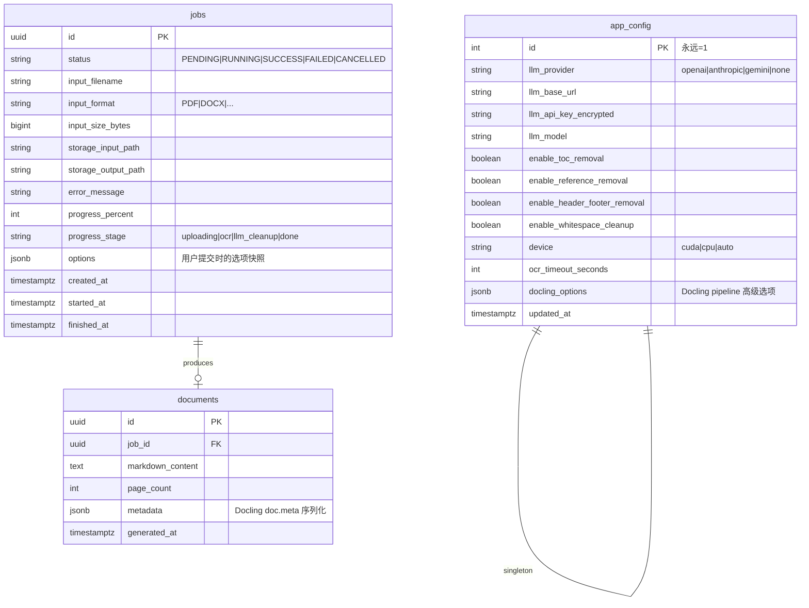
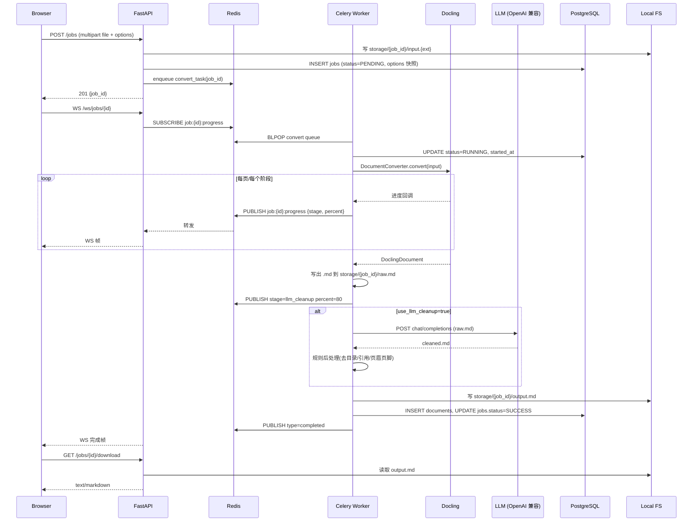

# Doc2MD System Design Document

| Version | Date | Description | Author |
| :--- | :--- | :--- | :--- |
| v1.0.0 | 2026-06-12 | Initial comprehensive system design for Doc2MD | Claude Fable 5 |
| v1.0.1 | 2026-06-12 | Clarification: deployment & testing must run on x-server (VPN-only), all Python deps in shared `/media/data/venv` | Claude Fable 5 |

---

## 1. Project Vision & Goals

**Doc2MD** 是一个高性能的智能文档转 Markdown 平台，旨在将各种非结构化或半结构化文档（如 PDF、DOCX、PPTX、图片、HTML 等）转换为结构清晰、排版整洁、适合大模型（RAG/LLM）消费或直接阅读的 Markdown 格式。

### 1.1 核心目标
- **高保真转换**：集成 **Docling** 作为核心布局分析与转换引擎，在 GPU 加速下实现快速且高保真的文档解析。
- **智能后处理**：集成 LLM 清洗管道，智能去除文档转换后产生的页眉、页脚、页码、冗余空白等噪音，并提供目录和参考文献的可选去除功能。
- **生产就绪架构**：基于 FastAPI、Celery、Redis 和 PostgreSQL，采用异步任务队列、单进程 GPU 独占、WebSocket 进度推送等机制，确保系统在高负载下的稳定性和响应性。
- **现代化 Web UI**：提供极简、美观、响应迅速的 React 页面，支持文件拖拽上传、选项配置、实时进度跟踪、双栏 Markdown 预览和一键导出下载。

---

## 2. System Architecture & Process Topology

系统采用三层架构设计：前端 Web UI、API 路由网关、异步任务处理 Worker。

```
┌─────────────────────────────────────────────────────────────────┐
│                         x-server 主机                           │
│                                                                 │
│  ┌──────────┐   HTTPS    ┌──────────────┐                      │
│  │ Browser  │◀──────────▶│   Nginx      │ :80/:443             │
│  └──────────┘            │ (前端静态)   │                      │
│       │  WSS             │ (反代 /api)  │                      │
│       │                  └──────┬───────┘                      │
│       │                         │                              │
│       │                         ▼                              │
│       │              ┌──────────────────────┐                  │
│       │              │   FastAPI (uvicorn)  │ :8000            │
│       │              │  - REST API          │                  │
│       │              │  - WebSocket /ws     │                  │
│       │              │  - 上传 / 配置读写   │                  │
│       │              └────────┬─────────────┘                  │
│       │                       │                                │
│       │            enqueue    │    broker                      │
│       │                       ▼                                │
│       │              ┌──────────────────────┐                  │
│       │   进度推送   │       Redis          │ :6379            │
│       │   (pub/sub)  │  - broker            │                  │
│       │              │  - result backend    │                  │
│       │              │  - pub/sub 频道      │                  │
│       │              └────────┬─────────────┘                  │
│       │                       │                                │
│       │                       ▼                                │
│       │              ┌──────────────────────┐                  │
│       │                       │                                │
│       │                       ▼                                │
│       │              ┌──────────────────────┐                  │
│       │              │  Celery Worker (×1)  │  独占 GPU         │
│       │              │  - Docling(GPU)      │                  │
│       │              │  - LLM 清洗 (可选)   │                  │
│       │              └────────┬─────────────┘                  │
│       │                       │                                │
│       │                       ▼                                │
│       │              ┌──────────────────────┐                  │
│       │              │    PostgreSQL        │ :5432            │
│       │              │  - jobs              │                  │
│       │              │  - documents         │                  │
│       │              │  - app_config (单例) │                  │
│       │              └──────────────────────┘                  │
│       │                       │                                │
│       │                       ▼                                │
│       │              ┌──────────────────────┐                  │
│       └─────────────▶│  /var/lib/doc2md/    │                  │
│         下载 MD      │  storage/            │                  │
│                      │   └─ {job_id}/       │                  │
│                      │       ├─ input.*     │                  │
│                      │       └─ output.md   │                  │
│                      └──────────────────────┘                  │
└─────────────────────────────────────────────────────────────────┘
```

### 2.1 组件职责划分
1. **Nginx**：
   - 静态托管编译后的前端 React 代码。
   - 反向代理 `/api` 请求到 FastAPI（端口 8000）。
   - 代理 `/api/v1/ws` 握手请求，并启用 WebSocket 支持（`Upgrade` 与 `Connection` 头部转发）。
2. **FastAPI (API Gateway)**：
   - 接收文件上传，生成 UUID `job_id`，将文件持久化写入本地存储路径 `/var/lib/doc2md/storage/{job_id}/input.{ext}`。
   - 向 PostgreSQL 写入初始任务记录（状态为 `PENDING`）。
   - 将任务 ID 推送至 Redis (Celery 队列) 中。
   - 接收 WebSocket 订阅请求，并基于 Redis Pub/Sub 订阅该任务的进度，实时转发给客户端。
   - 提供全局配置读取与修改 API（对明文 API 密钥进行加密和脱敏）。
3. **Redis**：
   - 作为 Celery 任务队列的 Broker。
   - 作为 Celery 任务执行结果的 Backend。
   - 作为 WebSocket 进度推送的 Pub/Sub 广播机制。
4. **Celery Worker**：
   - 强制配置为 **单 Worker、单进程（`--concurrency=1`）**，独占 x-server 的 GTX 1080 GPU。
   - 串行消费转换任务，避免多个进程并发调用 PyTorch 模型导致显存 OOM。
   - 调用 Docling 引擎进行 PDF/图片 的 OCR 及布局分析，或者进行 DOCX/PPTX 等文档的解析。
   - 可选调用外部 LLM API 进行转换后的 Markdown 文本清洗与重构。
   - 将最终的 Markdown 文件写入本地存储，并更新 PostgreSQL 中的任务和文档状态。
5. **PostgreSQL**：
   - 存储任务（`jobs`）、文档（`documents`）元数据。
   - 存储系统全局配置（`app_config`，单例表）。

---

## 3. Data Model Design

数据库采用 PostgreSQL，通过 SQLAlchemy ORM 进行访问，并使用 Alembic 进行数据版本迁移管理。



### 3.1 核心表字段说明
- **`jobs` 表**：
  - `id`：主键，使用 UUID v4，天然防止越权探测。
  - `status`：状态机，取值范围：`PENDING`（排队中）、`RUNNING`（处理中）、`SUCCESS`（成功）、`FAILED`（失败）、`CANCELLED`（已取消）。
  - `progress_stage`：当前所处阶段，包括 `uploading`（上传中）、`ocr`（Docling解析/OCR中）、`llm_cleanup`（LLM清洗中）、`done`（已完成）。
  - `options`：JSONB 字段，持久化保存该任务提交时，用户勾选的清理选项及设备配置。这避免了任务在执行期间，全局配置被修改而导致执行逻辑不一致。
- **`documents` 表**：
  - `markdown_content`：存储转换并清洗后的最终 Markdown 文本。
  - `metadata`：直接序列化 Docling 输出的 `doc.meta` 结构，保留原始文档的元信息（如作者、创建时间、页宽页高、提取的表格等）。
- **`app_config` 表**：
  - `id`：主键，强制为 `1`。通过 Check 约束或代码层 `INSERT ... ON CONFLICT DO NOTHING` 确保其为全局单例。
  - `llm_api_key_encrypted`：对称加密后的 LLM 密钥，使用 Python `cryptography` 的 Fernet 模块，密钥由环境变量 `DOC2MD_SECRET_KEY` 提供。在 API 响应中，该字段必须脱敏为 `******`。

---

## 4. API Spec & Real-time Communication

### 4.1 REST API (v1 前缀)

#### 4.1.1 任务管理
- **`POST /api/v1/jobs`**：
  - **Content-Type**: `multipart/form-data`
  - **参数**:
    - `file`: 二进制文件
    - `options`: JSON 字符串 (可选，覆盖默认配置)
  - **响应 (201 Created)**:
    ```json
    {
      "job_id": "8f830a6c-4861-460c-88e4-789a7101a0e1",
      "status": "PENDING",
      "created_at": "2026-06-12T17:30:00Z"
    }
    ```
- **`GET /api/v1/jobs`**：
  - **参数**: `page` (默认1), `limit` (默认20), `status` (过滤)
  - **响应 (200 OK)**: 任务列表分页数据。
- **`GET /api/v1/jobs/{id}`**：
  - **响应 (200 OK)**: 单个任务详情，包含当前进度、耗时、状态、错误信息。
- **`DELETE /api/v1/jobs/{id}`**：
  - **响应 (204 No Content)**: 删除任务记录，同时物理删除 `/var/lib/doc2md/storage/{id}/` 下的所有文件。
- **`POST /api/v1/jobs/{id}/cancel`**：
  - **响应 (200 OK)**: 取消排队中或执行中的任务。对执行中的任务调用 Celery 的 `revoke(terminate=True, signal='SIGTERM')`。

#### 4.1.2 转换结果获取
- **`GET /api/v1/jobs/{id}/result`**：
  - **响应 (200 OK)**:
    ```json
    {
      "job_id": "8f830a6c-4861-460c-88e4-789a7101a0e1",
      "markdown": "# Document Title\n\nContent...",
      "page_count": 12,
      "metadata": {}
    }
    ```
- **`GET /api/v1/jobs/{id}/download`**：
  - **响应 (200 OK, File Response)**: 流式返回 `.md` 附件，`Content-Disposition` 设为 `attachment; filename="{original_name}.md"`。

#### 4.1.3 配置管理
- **`GET /api/v1/config`**：
  - **响应 (200 OK)**: 全局配置，`llm_api_key_encrypted` 字段脱敏。
- **`PUT /api/v1/config`**：
  - **请求体**: 包含要更新的配置字段。
  - **响应 (200 OK)**: 更新后的配置。
- **`POST /api/v1/config/test-llm`**：
  - **响应 (200 OK)**: 触发一次测试 LLM 连接请求，返回连通性结果（成功/失败原因）。

---

### 4.2 WebSocket 实时进度通信

#### 4.2.1 路径与握手
`WS /api/v1/ws/jobs/{id}`

#### 4.2.2 消息机制 (Redis Pub/Sub 驱动)
为了在多 FastAPI 进程（Uvicorn 多 worker）和独立 Celery 进程之间传递实时进度，使用 Redis Pub/Sub：
1. Celery Task 在执行期间，向 Redis 频道 `job:{job_id}:progress` 广播 JSON 格式的进度帧。
2. FastAPI WebSocket 处理器在连接建立后，启动一个异步协程订阅 `job:{job_id}:progress` 频道。
3. 收到广播消息后，将其通过 WebSocket 连接直接发送给前端浏览器。
4. 任务状态转为 `SUCCESS` 或 `FAILED` 后，发送最后一个结束帧，随后关闭 Redis 订阅和 WebSocket 连接。

#### 4.2.3 进度帧格式
- **进度更新帧**：
  ```json
  {
    "type": "progress",
    "job_id": "8f830a6c-4861-460c-88e4-789a7101a0e1",
    "stage": "ocr",
    "percent": 45,
    "message": "Converting PDF: page 5/12 analyzed"
  }
  ```
- **完成帧**：
  ```json
  {
    "type": "completed",
    "job_id": "8f830a6c-4861-460c-88e4-789a7101a0e1",
    "result_url": "/api/v1/jobs/8f830a6c-4861-460c-88e4-789a7101a0e1/result",
    "download_url": "/api/v1/jobs/8f830a6c-4861-460c-88e4-789a7101a0e1/download"
  }
  ```
- **失败帧**：
  ```json
  {
    "type": "failed",
    "job_id": "8f830a6c-4861-460c-88e4-789a7101a0e1",
    "error": "Docling conversion timeout after 600s"
  }
  ```

---

## 5. Document Processing Pipeline

转换流水线是系统的核心。它由 Docling 转换引擎和 LLM 清洗管道组成。



### 5.1 Docling 转换引擎策略
- **设备自动检测**：支持 `cuda`、`cpu` 和 `auto`。在 `auto` 模式下，代码会执行 `torch.cuda.is_available()`，若为 `True` 则实例化 `cuda` 设备。
- **格式分流（Pipeline Selection）**：
  - **StandardPdfPipeline**：应用于 `PDF`、`IMAGE`（.png, .jpg, .jpeg, .tiff, .bmp, .webp）。由于这些格式需要进行版面分析、表格识别和 OCR，必须配置 `StandardPdfPipeline`。
  - **SimplePipeline**：应用于 `DOCX`、`PPTX`、`XLSX`、`HTML`、`EPUB` 等结构清晰、无需布局识别和 OCR 的文档格式。
- **进度跟踪钩子**：Docling 的 `DocumentConverter` 支持注册自定义的 `PipelineDescriptor`。我们通过它拦截每一页的解析事件，计算出 `(当前页 / 总页数) * 100` 的进度值，并通过 Redis Pub/Sub 实时广播。

### 5.2 LLM 清洗管道设计
当任务选项中 `use_llm_cleanup=true` 时，激活 LLM 后处理工序。

#### 5.2.1 OpenAI 兼容 API 调用
使用官方 `openai` 异步 SDK（或 httpx），调用用户在设置页配置的 API 地址、模型名称和密钥。

#### 5.2.2 提示词模板（System Prompt）
```
你是一个专业的学术和文档编辑专家。你的任务是清洗以下 Markdown 文本，并严格遵守以下要求：
1. 去除所有不属于正文的冗余信息，包括：页眉、页脚、页码。
2. 修正因 OCR 解析产生的明显拼接错误、错别字或断行折行，但绝对不能修改、润色或增删正文的核心原意。
3. 保持 Markdown 格式的完整性，特别是标题层级（#，##）和表格、列表格式。
4. 严格只返回清洗后的 Markdown 文本，不要包含任何旁白、解释或 ```markdown 标记。
```

#### 5.2.3 规则后处理（Rule-based Post-processing）
除了 LLM，一些特定内容的去除通过精确的**正则表达式和文本规则**来实现（更加稳定且节省 Token）：
- **去除目录（TOC）**：
  - 匹配 "目录"、"Contents"、"Table of Contents" 及其变体。
  - 剔除匹配点之后，直到第一个核心正文标题（如第一章 `# 1.`）之间的所有内容。
- **去除参考文献（References）**：
  - 匹配 "参考文献"、"References"、"Bibliography" 及其变体。
  - 剔除匹配点之后，直到文档末尾的所有内容。
- **空白合并**：
  - 将连续三个及以上的换行符折叠为两个换行符。
  - 去除行尾多余的半角/全角空格。

---

## 6. Frontend Web UI Design

前端采用 **React + Vite + TypeScript + TailwindCSS + shadcn/ui** 技术栈，追求高质感、高响应速度的交互体验。

### 6.1 核心页面与交互流

#### 6.1.1 首页 (Dashboard)
- **拖拽上传区 (DropZone)**：
  - 采用极简的虚线框设计，支持单文件、多文件拖拽，或者选择文件夹上传。
  - 限制上传格式（根据 Docling 支持的扩展名白名单过滤）。
- **转换选项面板 (Accordion 折叠)**：
  - 允许用户在上传前或上传后，自定义该批次任务的清理选项（勾选框）：
    - [ ] 启用 LLM 智能清洗
    - [ ] 规则去除目录 (TOC)
    - [ ] 规则去除参考文献 (References)
    - [ ] 规则去除页眉页脚页码
    - [ ] 规则合并冗余空白
  - 硬件设备选择：下拉菜单（Auto / CUDA GPU / CPU）。
- **任务看板 (Job List)**：
  - 采用卡片式或表格化展示历史任务。
  - 实时显示任务状态徽章：
    - `PENDING`：灰色沙漏。
    - `RUNNING`：蓝色旋转加载动画，并带有实时进度条和阶段文字（如 "OCR 阶段: 3/12 页"）。
    - `SUCCESS`：绿色勾选。
    - `FAILED`：红色警告，悬浮显示错误摘要。
  - 操作按钮：查看结果（仅 SUCCESS 可用）、流式下载、删除任务、取消任务（仅 PENDING/RUNNING 可用）。

#### 6.1.2 详情预览页 (Job Detail)
- **双栏布局**：
  - **左侧边栏**：显示文档元数据（文件名、原始大小、解析后大小、总页数、转换耗时、所用设备、清理选项快照）。
  - **右侧主预览区**：渲染转换后的 Markdown 内容。使用 `react-markdown` + `remark-gfm` + `rehype-raw` 支持复杂的表格、多级列表和内联 HTML。
  - **代码高亮**：使用 `prism` 或 `shiki` 对 Markdown 中的代码块进行语法高亮。
- **顶部控制栏**：
  - 一键复制 Markdown 文本。
  - 一键下载 `.md` 文件。
  - 返回列表。

#### 6.1.3 全局设置页 (Settings)
- **LLM API 配置**：
  - 接口提供商（OpenAI 兼容 / 其他）。
  - Base URL（例如 `https://api.deepseek.com/v1`）。
  - API Key（输入框采用密码隐藏模式，支持点击眼睛图标明文显示）。
  - Model Name（例如 `deepseek-chat`）。
  - **测试 LLM 连接 按钮**：点击后发起异步请求，前端展示 Loading，随后提示连接成功或失败原因。
- **Docling 默认参数**：
  - 默认 OCR 语言（多选：简体中文、英文、繁体中文等）。
  - 默认硬件设备（Auto / CUDA / CPU）。
  - OCR 超时时间设置（秒）。

---

## 7. Operational & Security Guardrails

### 7.1 硬件与资源保护（GPU 独占）
x-server 上的 GTX 1080 只有 8GB 显存，如果并发运行多个 Docling 实例，极易发生 `torch.cuda.OutOfMemoryError`。
- **串行执行**：Celery 启动参数硬性指定 `--concurrency=1`。
- **显存释放**：在每个任务结束时，显式执行以下代码释放 PyTorch 缓存：
  ```python
  import torch
  import gc
  gc.collect()
  if torch.cuda.is_available():
      torch.cuda.empty_cache()
  ```
- **超时保护**：为 Docling 转换设置硬性超时（默认 600 秒），防止损坏的 PDF 导致 Worker 进程无限死锁。

### 7.2 安全与隐私保护
- **文件白名单**：后端校验扩展名。
- **API Key 加密**：
  - 在数据库中，使用 Fernet 对称加密算法加密存储 LLM 密钥。
  - 密钥 `DOC2MD_SECRET_KEY` 必须从系统环境变量中读取，若未设置则系统拒绝启动。
  - 对外 API `/api/v1/config` 返回数据时，将密钥字段硬性替换为 `******`，防止前端泄露。
- **UUID 路由**：所有任务、文件下载路径均使用 UUID v4。即使不加鉴权，攻击者也无法通过递增 ID 遍历下载他人的敏感文档。

### 7.3 远程执行约束（x-server 强制）⚠️ 2026-06-12 澄清补充
- **运行环境唯一性**：Docling 的 GPU 加速依赖 CUDA + NVIDIA 驱动，这些能力仅存在于 x-server 主机上（GTX 1080 + CUDA 13.0）。
- **强制约束**：所有**部署**、**集成测试**、**端到端 (E2E) 测试** 都必须在 x-server 上运行。**严禁** 在开发本机（无 GPU）执行这些流程。
- **网络前提**：开发本机与 x-server 通过 **VPN 互通**，SSH 访问使用 `ssh x-server` 主机别名。
- **统一虚拟环境**：所有 Python 依赖（包括 `docling`、`torch`、PyTorch CUDA 运行时）均安装在 x-server 上的共享虚拟环境 `/media/data/venv` 中。开发本机不安装 `docling` / `torch`。
- **工作流分层**：
  - **开发本机**：仅做代码编辑、单元测试（mock 掉 GPU 与外部依赖）、前端 `pnpm dev`。
  - **x-server**：执行后端服务（FastAPI + Celery + Redis + PostgreSQL）、运行所有需要真实 Docling/PostgreSQL/Redis 的测试。
- **部署验证**：在 x-server 上完成 systemd 服务注册后，通过 `curl http://127.0.0.1:8000/api/v1/health` 验证 GPU 与数据库可用性，确认无异常才视为部署完成。

---

## 8. Implementation Phases & First Spec Scope

为了快速交付并降低迭代风险，我们将整个 Doc2MD 项目拆分为以下五个阶段：

```
Phase A（基础设施）：   环境搭建 + Docling GPU 验证 + FastAPI/前端骨架
Phase B（核心转换）：   文档上传 → Docling 转换 → Markdown 持久化
Phase C（LLM 后处理）： 可插拔 LLM 清洗管道（去页眉页脚/目录/引用）
Phase D（配置 + 前端）： 配置界面 + 用户偏好持久化
Phase E（生产化）：     鉴权/限流/监控/容器化部署
```

### 8.1 首个 Spec 交付范围 (Phase B + Phase C)
首个实施计划将聚焦于 **核心转换流程与 LLM 清洗管道的端到端打通**。
- **后端**：
  - 完成 PostgreSQL + Redis + SQLAlchemy + Alembic 基础设施搭建。
  - 实现 `/api/v1/jobs` 上传、状态查询、WebSocket 进度推送、结果下载端点。
  - 实现 Celery Worker 串行消费，打通 Docling (GPU/CPU 自动切换) 转换引擎。
  - 实现 OpenAI 兼容的 LLM 后处理清洗管道，以及基于规则的 TOC/References 去除。
- **前端**：
  - 初始化 React + Vite + TS + Tailwind + shadcn/ui 骨架。
  - 实现首页（文件上传、清理选项勾选、任务列表进度展示）。
  - 实现详情页（双栏布局、Markdown 高亮预览、一键下载）。
  - 实现设置页（LLM API 参数配置与连接测试）。
- **部署**：
  - 提供 systemd 服务配置文件和 Nginx 代理配置。

### 8.2 开发与测试执行地点（x-server 强制）⚠️ 2026-06-12 澄清补充
- **代码编辑与单元测试**：开发者在本机进行。可使用 IDE 远程开发（VSCode Remote SSH 到 x-server），或者本机编辑后通过 `git push` + x-server `git pull` 同步。
- **后端集成与 E2E 测试**：在 x-server 上执行。所有 `pytest` 命令在 `/media/data/venv` 虚拟环境中运行（`/media/data/venv/bin/pytest`）。
- **E2E 测试样本**：在 x-server 的 `/opt/doc2md/test_samples/` 目录下存放真实测试文档（PDF/DOCX/PPTX 等），测试代码以绝对路径引用。
- **前端开发**：`pnpm dev` 可在本机启动 Vite Dev Server，通过 VPN 访问 x-server 上的 FastAPI 后端。生产构建产物 (`pnpm build`) 通过 `rsync` 或 `scp` 推送到 x-server 的 `/var/www/doc2md/`。
- **CI/手测流程**：每次 PR 合并后，开发者需 SSH 到 x-server 拉取最新代码、重启 systemd 服务、执行 `/media/data/venv/bin/pytest backend/tests/e2e` 完成最终验证。

---

## Related
- [Architecture Overview](../design/ARCH_OVERVIEW.md)
- [Design Index](../design/index.md)
- [Requirements Index](../requirements/index.md)
